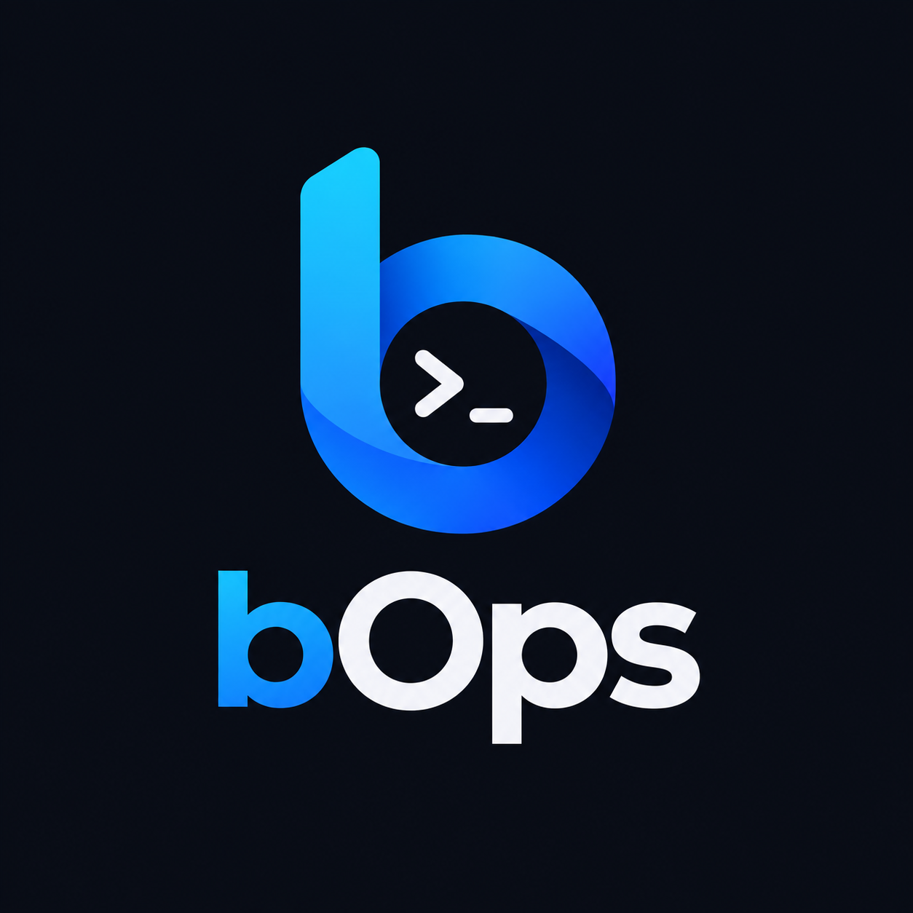

<div align="center">



# bOps

**An open-source agent runtime for safely operating Windows and Linux machines
through declarative tools, policies, planning and verification.**

[](#status)
[](https://dotnet.microsoft.com/)
[](#)
[](LICENSE)

</div>

---

## What bOps is

bOps is **not a chatbot with shell access**. It is infrastructure:

> the LLM proposes, the runtime decides and executes, policies authorize,
> verification confirms, the audit log records.

The model never touches the machine. It can only return a structured intent —
`{"tool": "...", "arguments": {...}}` — and a .NET runtime decides whether and
how that intent becomes an action.

## Non-negotiable principles

1. **The LLM never touches the machine.** It returns intent; the runtime executes.
2. **Every tool declares its own risk** (`Read`, `Low`, `Medium`, `High`, `Critical`)
   and policy decides the mode (`automatic`, `approval`, `forbidden`) — a declarative
   model, not a command blacklist.
3. **Every side-effecting action is verified afterwards.** "I restarted nginx" is not a
   valid conclusion until `service.status("nginx")` reports `ACTIVE`.
4. **Everything is audited** — every tool call emits a structured event, whatever the outcome.
5. **The core is agnostic** to LLM provider and operating system, both hidden behind interfaces.
6. **The CLI is the primary interface**, not a stopgap. The local Angular web UI — live task
   activity, approvals, a read-only plugin catalog and provider Settings — runs on the very same
   runtime, policy and audit path; it is not a second, more permissive door.
7. **Everything beyond the minimal runtime is a package** — System, Filesystem, Network,
   Docker, Service, Web and the LLM providers themselves load through the exact same extension
   contract a third-party package uses.

## How it works

```
REQUEST → UNDERSTAND → PLAN → EXECUTE → OBSERVE → EVALUATE ─┬─ goal reached? → FINAL
                          ▲                                  │
                          └──────────── REPLAN ──────────────┘
```

Each iteration passes through the same gates:

| Gate | Responsibility |
|---|---|
| **Registry** | Only tools available on this platform, with satisfied capabilities, are visible to the model |
| **Policy** | `automatic` / `approval` / `forbidden`, per risk level, per tool, per package |
| **Approval** | Human-in-the-loop for anything above the automatic ceiling |
| **Execution** | Typed, validated arguments — there is no generic "run this command" tool |
| **Verification** | A read-only tool confirms the effect actually happened |
| **Audit** | Append-only structured event, success or failure |

## Architecture

```
src/
├── core/
│   ├── bOps.Abstractions/   # The contract / plugin SDK — zero dependencies
│   ├── bOps.Runtime/        # Agent loop, registries, Skills, encrypted local vault, Settings
│   ├── bOps.PluginHost/     # Dynamic package loader (V0.10, ADR-0020): manifest, isolated
│   │                        # AssemblyLoadContext, install/enable/disable/remove
│   ├── bOps.Policy/         # Risk model, policy engine, approval flow
│   ├── bOps.Memory/         # Task state and conversation context (SQLite)
│   ├── bOps.Audit/          # Append-only structured audit log
│   ├── bOps.Cli/            # `bops "..."` — the primary interface
│   ├── bOps.Api/            # Authenticated minimal API backing the web UI
│   └── bOps.Worker/         # Windows Service / systemd unit — not built yet
├── packages/                # First-party packages — same contract as third-party ones
│   ├── bOps.Packages.System.{Core,Windows,Linux}
│   ├── bOps.Packages.Service.{Core,Windows,Linux}   # V0.11, ADR-0021
│   ├── bOps.Packages.{Filesystem,Network,Docker,Web}
│   └── bOps.Packages.Providers.*   # OpenRouter, Ollama, llama.cpp, OpenAI, DeepSeek, Anthropic
├── samples/
│   └── bops-sample-plugin/  # A real, purely-demonstrative third-party plugin — see docs/plugins/
└── web/
    └── bops-ui/             # Local Angular UI (Dashboard, Approvals, Plugins, Settings)
```

The core is deliberately small: loop, registries, policy, memory, audit, contract.
Everything else is a package. The only difference between a first-party package and a
third-party one is *where it is loaded from*, never *how it is built*.

**Operating systems are packages too.** Each OS package contributes its own complete tools,
declaring the platforms it serves; the registry picks by platform automatically. Adding a
platform means writing a package — never changing the core.

## Tools

Registered today — this table tracks what actually loads, not what is planned; see the note
below it for what's coming and, deliberately, what never will.

| Package | Tools |
|---|---|
| **System** | `system.info` `system.apps` `system.devices` `system.events` `system.cpu` `system.memory` `system.disk` `system.swap` `system.io` |
| **Process** | `process.list` `process.inspect` `process.stop` `process.kill` |
| **Filesystem** | `fs.list` `fs.stat` `fs.read` `fs.write` `fs.delete` `fs.search` `fs.hash` `fs.move` `fs.size` `fs.delete_tree.prepare` `fs.delete_tree` `fs.delete_tree.verify` |
| **Network** | `network.interfaces` `network.connections` `network.dns` `network.ping` `network.port_check` `network.route` |
| **Service** | `service.list` `service.status` `service.start` `service.stop` `service.restart` (Windows via `ServiceController`, Linux via a fixed `systemctl` invocation — ADR-0021) |
| **Docker** | `docker.containers` `docker.inspect` `docker.logs` `docker.images` `docker.networks` `docker.start` `docker.stop` `docker.restart` |
| **Web** | `web.search` `web.fetch` |

`system.events` (V1.3-A) reads recent Windows Event Log or journald events as bounded, newest-first JSON
that says whether it is complete (see [`docs/system-events.md`](docs/system-events.md)). V1.3-B (additional Docker
image/build/volume tools) is planned work and is intentionally not listed in the registered-today table until its
implementation gate passes.

V0.11 is fully registered. `system.apps`, `system.devices`, `fs.size`, governed permanent recursive
deletion and the Web package are implemented for the V1.1 preview; their bounded output, supported
native sources and explicit completeness semantics are documented in
[`docs/system-inventory.md`](docs/system-inventory.md) and
[`docs/filesystem-inventory.md`](docs/filesystem-inventory.md). Recursive/batch deletion requires a
complete hash-bound manifest and explicit approval; see
[`docs/governed-recursive-deletion.md`](docs/governed-recursive-deletion.md).
`web.search` is invisible until an operator configures a SearXNG endpoint, and `web.fetch` denies
loopback/private/link-local/metadata network destinations by default; see
[`docs/security/web-network-policy.md`](docs/security/web-network-policy.md).

The Angular UI's **Plugins** page (`GET /api/plugins`, `GET /api/plugins/{id}`) is a read-only
catalog of installed plugins — id, version, publisher, signature/trust, installed/enabled/loaded/
compatible state (kept distinct, never merged into one "status"), declared capabilities and
dependencies, and declared-vs-effective maximum risk. Enable, disable, install and remove stay
`bops plugin *`-only; no mutation path exists through the API in this batch. `bOps.Api` now
activates the operator's already-enabled plugins at start-up exactly like `bOps.Cli` always has —
it runs its own `AgentRunner` for tasks started from the dashboard and needs the same
plugin-contributed tools/Skills.

The Angular UI's **Settings** page (`GET/PUT/DELETE /api/settings/*`, administrator role,
ADR-0029) is where a provider's endpoint, model, tool-calling support and API key are fully
managed: choose the active provider, save its endpoint/model, set or replace its key, or clear it.
API keys never round-trip in plaintext — every response carries only presence, a `first
six...last four` mask and timestamps. Keys are stored in a versioned, AES-256-GCM-encrypted local
vault whose master key is supplied externally and never written beside it; a wrong key, tampered
file or missing master key fails closed. An explicit `ModelProvider__Provider` environment
variable always overrides Settings, so existing CLI/environment deployments are unaffected unless
an operator opts in. Provider selection and secret changes take effect on the next restart. See
[ADR-0029](docs/architecture/adr/0029-encrypted-local-vault-and-master-key.md) and "Provider
credentials" below for enabling the vault and rotating its master key.

**Never planned, on purpose:** `system.uptime` (`system.info` already reports it — a second tool
for the same data won't be added), `system.environment` as an unfiltered dump (would hand secrets
to the model), and a generic `process.start` (equivalent to a generic execution tool — see rule
S1). None of these are gaps; they're explicit non-goals.

**Scope notes:**

- `network.route` reports each active interface's directly connected subnet and default
  gateway — genuinely useful for "can this host reach the internet from here?" — not the full OS
  routing table (every destination-specific static route), which would need `GetIpForwardTable2`
  on Windows and `/proc/net/route` parsing on Linux for a shape few ops questions actually need.
- Filesystem tools read nothing until `Filesystem:ReadPatterns` names what they may read — the
  shipped configuration is deny-all on purpose. For local use, put your own patterns in the
  git-ignored `appsettings.Development.json` next to `appsettings.json`.
- `fs.hash` is SHA-256 only, single algorithm, by design.
- `fs.move` never overwrites an existing destination — a deliberate refusal, not a limitation; a
  deliberate overwrite is a separate `fs.delete` then `fs.move`.
- `process.stop` on Windows can only close a process that has a main window
  (`CloseMainWindow()`) — Windows has no generic SIGTERM equivalent for an arbitrary process, and
  this tool reports that honestly as a failure rather than silently escalating to a forced kill.
  On Linux, `process.stop` sends a real `SIGTERM`, which always applies. `process.kill` (forced,
  `TerminateProcess`/`SIGKILL`) works identically on both platforms.
- `service.start`/`stop`/`restart` on Linux are exercised for real in CI against `systemctl`
  (via the same code path `service.list`/`status` already prove works); the full elevated
  create→start→stop→delete lifecycle is exercised for real only on Windows CI, which runs
  administrator-elevated by default — the equivalent on Linux would need root or a polkit rule
  this project does not control, so it is a documented gap (`HANDOFF.md`), not a silent one.

## LLM providers

Providers are packages too, resolved by id at startup — never a hardcoded switch.

| Provider | Transport | Phase |
|---|---|---|
| OpenRouter | OpenAI-compatible | 1 |
| Ollama | OpenAI-compatible (`/v1`) | 1 |
| llama.cpp (`llama-server`) | OpenAI-compatible, JSON-schema fallback | 1 |
| OpenAI · DeepSeek | OpenAI-compatible | 2 |
| Anthropic | native Messages API adapter | 2 |

Anything else — Bedrock, Vertex, Groq — can be added by a third party as a provider
package, without touching bOps.

## Usage

```bash
bops "this server is slow, find the problem"
bops "check every Docker container and tell me if something is wrong"
bops "list the files under this directory and tell me what's taking up the most space"
bops "delete this temp file"        # fs.delete is High-risk — requires approval before it runs
bops "permanently delete these trees" # exact manifest; fs.delete_tree always requires approval
bops "search the web for the current LTS .NET version and fetch its release notes"
```

```bash
bops resume <task-id>          # resume a persisted task (V0.7, SQLite-backed) from where it left off
```

```bash
bops delegate "why did nginx stop?"                        # V1.2: a diagnosis by four roles, each with less authority than you
bops delegate "fix nginx" --skill service.skill --capability service.restore --target web-1 --environment prod
                                                           # ... and a change: you approve the plan by its hash first
bops delegate status|resume|cancel <run-id>                # read, continue or end a stored run
bops delegate reconcile <run-id> --accept|--abandon        # settle a step whose outcome is not known; it is never retried
# over HTTP: /api/delegations (docs/agents/delegations-api.md); model and limits: docs/agents/delegation.md
```

Delegation is off until `policy.yaml` has a `delegation` section (ADR-0031; [how to write it](docs/agents/delegation-policy.md)). Exit codes: `0` completed or diagnosed, `1` failed
or a usage error, `2` denied or blocked by policy, `3` rejected or abandoned, `4` requires reconciliation, `5` budget or
deadline exceeded, `6` verification did not confirm, `10` not finished, `130` cancelled.

```bash
bops audit verify [audit-file]   # verify the complete append-only audit hash chain

bops plugin install <directory>   # install a local plugin build — disabled until you enable it
bops plugin list                  # every installed plugin, enabled or not
bops plugin enable <id>           # activate now, and on every future run, until disabled
bops plugin disable <id>          # unload it; its files stay on disk
bops plugin remove <id>           # disable (if enabled) and delete it
bops plugin validate <directory>  # check a bops-plugin.json without installing anything
bops plugin sign <directory> <publisher> <key-id> <private-key.pem>
```

`bops diagnose` is **not implemented** — there is no such subcommand, planned or otherwise.

Provider credentials are references, not committed values. The CLI resolves its default model
credential from `BOPS_MODEL_API_KEY`; the API resolves its model credential from
`BOPS_MODELPROVIDER_API_KEY`. The API additionally requires `BOPS_API_KEY` and accepts it only as
`Authorization: Bearer <key>`; query-string credentials are never supported. The local UI keeps
the API credential in memory and loses it on refresh by design. Bind the API to loopback, or put
TLS and an authenticated reverse proxy in front of it.

### Enabling the Settings page (the credential vault)

The Angular UI's Settings page (provider endpoint, model and API key, ADR-0029) needs the encrypted local vault, and the vault needs a
master key that you provide from outside the repository. The shipped `src/core/bOps.Api/appsettings.json` names the environment
variable that holds it (`Vault:MasterKeySecret`, pointing at `BOPS_VAULT_MASTER_KEY`), never the key itself. Because that reference is
configured, **the API refuses to start until `BOPS_VAULT_MASTER_KEY` is set** to a key of at least 20 characters. If you do not want the
vault, remove `MasterKeySecret` from the `Vault` section: the `/api/settings/*` endpoints are then not mapped, the API answers `404` and
the Settings page says the vault is not configured. Everything else behaves as before.

1. **Create a master key**: any secret of at least 20 characters. Keep it in your password manager, not in the repository.

   ```powershell
   # PowerShell
   [Convert]::ToBase64String([Security.Cryptography.RandomNumberGenerator]::GetBytes(32))
   ```

   ```bash
   # bash
   openssl rand -base64 32
   ```

2. **Put it in the environment of the process that runs `bOps.Api`**, next to `BOPS_API_KEY`:

   ```powershell
   $env:BOPS_VAULT_MASTER_KEY = '<the key from step 1>'
   ```

   ```bash
   export BOPS_VAULT_MASTER_KEY='<the key from step 1>'
   ```

   If `bOps.Api` is started by a launcher (an Aspire AppHost, a service, a container), set the variable in that launcher's
   environment; a variable set in another terminal does not reach it.

3. **Point the API at it.** The shipped `appsettings.json` already does, so with step 2 done there is nothing to edit. To use another
   variable name, or a different setup, use either of these (the same configuration, two spellings):

   - environment variables, no file to edit:

     ```powershell
     $env:Vault__MasterKeySecret__Provider = 'environment'
     $env:Vault__MasterKeySecret__Name = 'BOPS_VAULT_MASTER_KEY'
     ```

   - or the `Vault` section of the API's configuration (`src/core/bOps.Api/appsettings.json`, or an `appsettings.Production.json` you
     keep out of git). `FilePath` is optional and defaults to `vault.dat` in the API's working directory, like `tasks.db` and
     `audit.jsonl`:

     ```json
     "Vault": {
       "FilePath": "vault.dat",
       "MasterKeySecret": { "Provider": "environment", "Name": "BOPS_VAULT_MASTER_KEY" }
     }
     ```

     The provider is `environment` (the value of the variable named in `Name`). `MasterKeySecret` has no built-in default: the vault is
     active only while it is present in the configuration.

4. **Start `bOps.Api` and check.** `GET /api/settings` with your `BOPS_API_KEY` (an `administrator` key) answers `200`, and the
   Settings page lists the providers. The page is visible to administrators only.

What the API does at start-up, so the errors are not a surprise:

| Situation | Result |
|---|---|
| No `Vault:MasterKeySecret` in the configuration | Vault off: `/api/settings/*` answers `404`, the Settings page says so. |
| Configured, but the environment variable is unset or empty | The API **refuses to start**, naming the variable. |
| Configured, but the value is shorter than 20 characters | The API **refuses to start**. |
| Configured and valid | Vault on. Keys entered in Settings are encrypted (AES-256-GCM) in `vault.dat`; profiles and the active provider are in `settings.json`. Changes take effect on the next restart. |

The master key is never stored beside `vault.dat`, and no endpoint returns a stored key. Losing the master key means re-entering the
provider keys in Settings. Rotate the master key with the CLI (not exposed through the API, by design):

```bash
BOPS_VAULT_MASTER_KEY=<current-key> BOPS_NEW_VAULT_MASTER_KEY=<new-key> \
  bops vault rotate-key BOPS_NEW_VAULT_MASTER_KEY
```

Backup/restore is file-level: copy `vault.dat`. Because the master key is deliberately never
stored beside it, a copied vault file alone is inert — losing the vault means re-entering keys
through the UI, exactly like losing `plugins.json` means reinstalling plugins.

## Roadmap

**V0.1 through V1.1 are implemented.** The formal V1.0 release workflow still needs its first
operator-authorized tagged run, and V1.1 is likewise untagged. V1.1-A through V1.1-H are complete,
including the cross-platform integration and release gate, which is green on Windows and Linux CI.
V1.2 (multi-agent orchestration) is implemented as a preview: its sub-tasks A–M are complete and the integration and release gate is closed.

| | |
|---|---|
| `V0.1` | Minimal runtime: chat model, tool registry, first read-only System tools |
| `V0.2` | Explicit agent loop with replanning |
| `V0.3` | Policy engine + approval flow |
| `V0.4` | Post-action verification |
| `V0.5` | Windows + Linux parity, Filesystem and Network packages, CI on both OSes |
| `V0.6` | Docker package with conditional capability discovery |
| `V0.7` | Persistent, resumable tasks (SQLite) |
| `V0.8` | Anthropic, OpenAI and DeepSeek provider packages |
| `V0.9` | `bOps.Api` + Angular UI: live agent activity, approvals, settings |
| `V0.9.1` | Repository integrity and licensing readiness — SPDX headers, SBOM, NOTICE, CI fixed |
| `V0.10` | Dynamic plugin loader (`bOps.PluginHost`, ADR-0020): manifest, isolated `AssemblyLoadContext`, `bops plugin *` |
| `V0.11` | Full operational capability set: `system.swap`/`io`, `process.inspect`/`stop`/`kill`, `fs.search`/`hash`/`move`, `network.port_check`/`route`, and the new `Service.{Core,Windows,Linux}` package (`service.list`/`status`/`start`/`stop`/`restart`, ADR-0021) |
| `V1.0` | Stable `bOps.Abstractions` 1.0 SDK; API authentication/roles; secret references; bounded/idempotent/cancellable execution; verified plugin provenance; audit verification; locked, reproducible SBOM/provenance release pipeline (ADR-0022) |
| `V1.1-A` *(complete)* | Skill provider interfaces, restricted tool invocation, contextual policy, terminal-run semantics and end-to-end OSS sample Skill |
| `V1.1-B–F` *(complete)* | Add bounded system/device inventory, filesystem sizing, hash-bound recursive deletion, SearXNG-backed Web search/safe fetch, and a read-only plugin catalog API/UI |
| `V1.1-G` *(complete)* | Writable Settings backed by an encrypted local vault (ADR-0029) |
| `V1.1-H` *(complete)* | Cross-platform integration, documentation and release gate |
| `V1.2` *(complete, preview)* | In-process multi-agent orchestration with privilege-reducing delegation |
| `V1.3-A` *(implemented)* | Bounded cross-platform `system.events`: Windows Event Log + Linux journald |
| `V1.3-B` | Docker image/build/volume management; existing start/stop/restart remain the container lifecycle baseline |
| `V1.3-C–K` | Process, network, storage, filesystem, service/scheduler, identity/time, firewall, TLS/certificates, updates/crashes/drivers |
| `V1.3-L` | Senior-operator diagnostic integration gate and evidence baseline for future Skills |
| `V1.3-M` | Neutral entitlement boundary and safe local plugin enable/disable/upload |
| `V1.4-A–C` | Outbound secure node protocol, private Coordinator and PostgreSQL+pgvector persistence baseline |
| `V1.4-D` | Semantic Knowledge Store + tenant-private Operational Memory + versioned Knowledge/Experience Packs |
| `V1.4-E` | Official packaging and signed application/knowledge-pack distribution |
| `V1.5–V1.9` | Private commercial PostgreSQL/SQL Server Skills and enterprise Portal |
| `V2.0` | Enterprise GA, recovery, compatibility, security and release readiness |

The [consolidated roadmap](agentic/_plans/2026-09-16-consolidated-roadmap.md) is the single active
plan and links every executable public task with its recommended model effort. Historical plans and
migration inputs are archived under `agentic/obsolete/` and are intentionally ignored by coding
agents. `bOps` itself stays Apache-2.0 forever, including commercial use — see
[Licensing](#license) and [`docs/licensing.md`](docs/licensing.md).

## Extending bOps

A plugin is one or more .NET assemblies referencing only the published `bOps.Abstractions`
package, with an entry type implementing `IToolProvider`, `ISkillProvider` or
`IModelProviderPackage`, plus a `bops-plugin.json` manifest naming it.
[`samples/bops-sample-plugin/`](samples/bops-sample-plugin/) is a real, working Skill/Tool plugin —
build it, then `bops plugin install`/`enable` it, as a starting point:

```json
{
  "SchemaVersion": 1,
  "Id": "acme.sample-plugin",
  "Publisher": "Acme",
  "Version": "1.0.0",
  "MinHostAbstractionsVersion": "1.1.0",
  "EntryAssembly": "Acme.SamplePlugin.dll",
  "EntryType": "Acme.SamplePlugin.SampleToolProvider",
  "DeclaredCapabilities": ["sample.echo-marker"],
  "Dependencies": [],
  "MaxDeclaredRisk": "Low"
}
```

Packages are never trusted at their word. For a Skill provider, `DeclaredCapabilities` must
exactly match the activated Capability names or activation fails; `Dependencies` and
`MaxDeclaredRisk` remain operator-facing declarations, while the policy engine's own per-package
risk ceiling in `policy.yaml` is what is actually enforced.
A plugin is loaded in an isolated, collectible `AssemblyLoadContext` sharing a single copy of
`bOps.Abstractions` with the host (ADR-0020) and stays disabled until an operator enables it
explicitly. V1.0 also requires a detached RSA-PSS/SHA-256 signature whose publisher key and trust
level appear in the operator-owned `publisher-trust.json`; unsigned or unknown-key packages may
be inspected but cannot be enabled. See [`docs/plugins/getting-started.md`](docs/plugins/getting-started.md)
for the full walkthrough, and rule S8: this isolation is dependency isolation, not a security
sandbox — a loaded plugin runs with the host's own privileges.

## Status

**V1.1 is a preview, not a release.** All eight V1.1 batches (A–H) are implemented and the V1.1-H
integration gate is closed: Release build with zero warnings, the .NET suite excluding live-model
tests, the Angular production build and headless tests, SDK packing and an install/enable/disable/
remove smoke test of the signed sample plugin all passed locally, and GitHub Actions is green on
Windows and Linux (runs `35365098294` and `35372748588`). The public SDK is versioned
`1.1.0-preview.2`, additive over 1.0.

The release workflow has been proven on tag `v1.1.0-preview.2` (commit `c81ffab`, run
`35383901325`): both the Windows and Linux jobs are green and produced the reproducible runtime
archives, the `bOps.Abstractions` package, CycloneDX SBOMs and SHA-256 checksums, all attested with
GitHub build provenance. The earlier tag `v1.1.0-preview.1` failed its run (host-specific AppHost
lock, missing UI install before the SBOM step) and produced no artifacts; it is kept unchanged and
superseded. The artifacts are workflow artifacts, not a GitHub Release or a NuGet publication, and
this is not yet a production endorsement.

**V1.2 is a preview, not a stable release** (tag `v1.2.0-preview.8`, published as a GitHub pre-release, run `35516050493`, not a NuGet publication). Delegated runs (`bops delegate`, `/api/delegations`, the dashboard's Delegations view) are
implemented, each sub-task passed Windows and Linux CI, and the integration and release gate is closed (a real objective end to end with
real tools, a crash and resume, and the frozen 1.0 surface kept by a permanent test). Treat the feature as a preview: the public SDK is
`1.2.0-preview.8`, and what it does not do is stated in
[`docs/agents/delegation.md`](docs/agents/delegation.md).

## Documentation

| | |
|---|---|
| [`agentic/00-bootstrap.md`](agentic/00-bootstrap.md) | Stable agent bootstrap, required read order and validation baseline |
| [`agentic/`](agentic/) | Binding specification, active plans and task tracking |
| [`agentic/06-decisions.md`](agentic/06-decisions.md) | Decision register: what was chosen, what was rejected, why |
| [`agentic/_plans/2026-09-16-consolidated-roadmap.md`](agentic/_plans/2026-09-16-consolidated-roadmap.md) | Single active roadmap — actual status, ordered gates, open-core boundary and task index |
| [`agentic/_tasks/README.md`](agentic/_tasks/README.md) | Detailed executable public tasks with model-effort guidance |
| [`docs/licensing.md`](docs/licensing.md) | What Apache-2.0 does and doesn't grant, the open-core repository split, CLA policy |
| [`docs/architecture/`](docs/architecture/) | Architecture decision records |
| [`docs/security/`](docs/security/) | Risk model, default policies, threat model |
| [`docs/governed-recursive-deletion.md`](docs/governed-recursive-deletion.md) | Exact manifest, mandatory approval, bounds and partial-failure recovery |
| [`docs/security/web-network-policy.md`](docs/security/web-network-policy.md) | SearXNG setup, `web.fetch` SSRF/redirect/decompression policy and configuration |
| [`docs/plugins/getting-started.md`](docs/plugins/getting-started.md) | Write your first bOps plugin |
| [`docs/agents/delegation.md`](docs/agents/delegation.md) | Delegated runs: roles, authority reduction, approval, resume, and what they do not do |
| [`docs/agents/delegation-policy.md`](docs/agents/delegation-policy.md) | Turning delegation on in `policy.yaml`, with a working example |
| [`docs/agents/delegations-api.md`](docs/agents/delegations-api.md) | The `/api/delegations` endpoints and their roles |
| [`docs/knowledge/knowledge-pack-format.md`](docs/knowledge/knowledge-pack-format.md) | V1.4-D normative format for signed/versioned Knowledge and Experience Packs |
| [`docs/knowledge/experience-pack-authoring.md`](docs/knowledge/experience-pack-authoring.md) | How to create reusable incidents without customer data and release independent pack updates |

## License

Apache-2.0 — see [LICENSE](LICENSE), always and for everyone, including commercial use.
Packages are separately licensed: bOps does not require third-party packages to be open
source. `bOps` follows an **open-core** model: the core, SDK, first-party packages and this
local UI stay Apache-2.0 in this public repository; official commercial Skills, a Control
Plane and an enterprise Portal live in a separate private repository and are never merged
here. The private `bOps.Workspace` coordination repository pins the public and commercial repositories
as Git submodules without duplicating their source or changing their licenses. See
[`docs/licensing.md`](docs/licensing.md) for the full policy, including what
Apache-2.0 does not grant (no trademark rights — `bOps`/`bSoft` are not registered marks) and
how third-party packages and contributions (via CLA) are handled.
