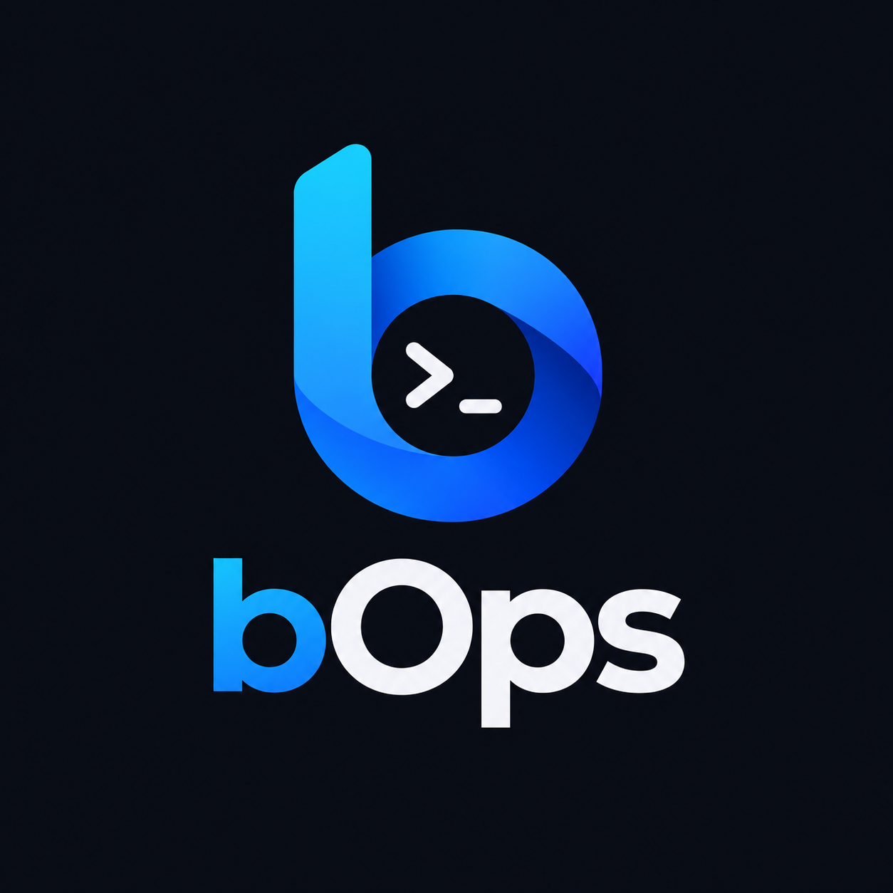

<div align="center">



# bOps

**An open-source agent runtime for safely operating and troubleshooting Windows and Linux machines
through typed tools, policy, verification and audit.**

[](#project-status)
[](https://dotnet.microsoft.com/)
[](#capabilities)
[](LICENSE)

</div>

---

bOps lets a language model investigate a machine and, when you allow it, repair it — without ever
giving the model a shell. You describe a goal in plain language; the model proposes structured
steps; a .NET runtime decides whether each step may run, runs it through a bounded typed tool,
checks that it worked, and records what happened.

> **The LLM proposes; the runtime decides and executes; policies authorize; verification
> confirms; audit records.**

## What is bOps?

- A **local operational agent runtime** for Windows and Linux, driven from a CLI, a local API or a
  web UI.
- Built for **troubleshooting first**: slowness, crashes, full disks, stopped services, unhealthy
  containers — and for **governed remediation** when policy and an operator allow it.
- **Provider-independent**: any supported model provider, or your own, behind one interface.
- **Extensible**: tools, Skills and model providers are packages loaded through the same contract
  that first-party code uses.
- **Not** a chatbot with shell access, a generic remote-command executor, or a system where the
  model calls the operating system directly. There is no `shell.run`, no `process.start` and no
  "execute this command" tool under any name.

## What can I do with it?

```bash
bops "this server has been slow for ten minutes; find out why"
bops "analyse recent Windows crashes and tell me what evidence points to the cause"
bops "check all Docker containers and identify anything unhealthy"
bops "find what is consuming disk space"
bops "find out why nginx stopped"
bops "restart nginx and verify that it is healthy"
bops resume <task-id>
bops delegate "find out why this production server is intermittently unavailable"
```

- Read-only investigation runs automatically. Anything that changes the machine — restarting a
  service, stopping a process, deleting files — goes through policy: actions above the
  automatic risk ceiling ask you for approval first, while policy may allow low-risk changes
  to run automatically.
- After a change, bOps confirms the effect with a read-only check (for example, the service is
  really `ACTIVE`) before it reports success.
- `bops resume` continues a failed, cancelled or budget-stopped task as a new execution attempt.
- `bops delegate` runs an objective through four roles — Discovery, Diagnostic, Remediation,
  Verification — each with less authority than you. A diagnosis needs only Discovery and
  Diagnostic and stays read-only; a change needs all four and your approval of the plan,
  identified by its hash. Delegation is off until you configure role profiles; for a diagnosis,
  `bops delegate profiles init --read-only` generates read-only ones for you to review. See
  [Delegation](docs/agents/delegation.md) and [its setup](docs/agents/delegation-policy.md).

`bops delegate` exit codes:

| Command | Exit codes |
|---|---|
| `bops delegate "<objective>"`, `status`, `resume`, `cancel`, `reconcile` | `0` completed or diagnosed · `1` failed or usage error · `2` denied or blocked by policy · `3` rejected or abandoned · `4` requires reconciliation · `5` budget or deadline exceeded · `6` verification did not confirm · `10` not finished · `130` cancelled |
| `bops delegate readiness [--remediation]` | `0` ready · `2` not ready · `1` usage or composition error |
| `bops delegate profiles init --read-only [--write [--overwrite]]` | `0` printed or written · `1` usage error, refusal or I/O error |
| `bops delegate profiles check` | `0` no drift · `2` drift that blocks delegation for some request shape · `8` informational drift only · `1` usage or composition error |

## How it works

```text
REQUEST → PLAN → EXECUTE → OBSERVE → EVALUATE ─┬─ goal reached? → FINAL
                   ▲                           │
                   └────────── REPLAN ─────────┘
```

Every step the model proposes passes the same gates:

| Gate | Responsibility |
|---|---|
| **Registry** | Only tools that exist on this platform, with their requirements met, are visible to the model |
| **Policy** | Each tool declares a risk level; policy maps it to `automatic`, `approval` or `forbidden` |
| **Approval** | A person decides anything above the automatic ceiling |
| **Execution** | Typed, validated arguments and bounded output; no generic command execution |
| **Verification** | A read-only tool confirms that a side effect actually happened |
| **Audit** | An append-only structured event for every call — including denials, rejections and timeouts |

## Safety model

- **The model never touches the machine.** It returns an intent such as
  `{"tool": "...", "arguments": {...}}`; the runtime decides what happens.
- **Tools are typed and bounded.** Each one has a schema, limits on rows, bytes and time, and a
  declared risk level. Policy is declarative — it is not a command blacklist.
- **Risk drives control.** Actions above the automatic risk ceiling require approval; policy
  may allow low-risk changes automatically. `Critical` actions are forbidden by the policy
  engine itself, whatever the policy file says.
- **Side effects are verified.** A non-read tool cannot be registered without a verification
  specification. "I restarted nginx" is not a conclusion until a check says so.
- **Tool output is data, never instruction.** It reaches the model as a delimited tool result and
  cannot change tools, policy or budget.
- **Audit is structured and tamper-evident.** `bops audit verify` checks the hash chain.
- **Deny by default where it matters.** The shipped filesystem configuration reads nothing until
  you list allowed paths; `web.fetch` refuses loopback, private and metadata addresses; a
  `policy.yaml` that fails to load forbids everything rather than allowing anything.

Details: [threat model](docs/security/threat-model.md) ·
[web network policy](docs/security/web-network-policy.md) ·
[governed deletion](docs/governed-recursive-deletion.md).

## Capabilities

Capabilities are packages, available on Windows and Linux unless a document says otherwise.

| Area | Examples |
|---|---|
| System | CPU, memory, swap, disk, I/O, events, crashes, updates, drivers, time, pending reboot, apps, devices |
| Processes | list, inspect, metrics, tree, modules, stop, kill |
| Filesystem | list, stat, search, grep, tail, size, hash, permissions, locks, copy, move, governed deletion |
| Network | interfaces, sockets, routes, neighbors, DNS, ping, port check, traceroute, NTP probe |
| Storage | disks, partitions, mounts, performance, health |
| Services | list, status, dependencies, configuration, start, stop, restart, enable, disable |
| Scheduler | Task Scheduler / systemd timers / cron inventory, history, enable, disable |
| Docker | containers, logs, images, networks, volumes, builds, start/stop/restart |
| Security | firewall status and rules, TLS probe, certificate inspection (all read-only) |
| Identity | current user, users, groups, sessions |
| Web | `web.search` (needs a SearXNG endpoint) and `web.fetch` (safe fetch) |

Tools are named `<area>.<action>` — for example `service.restart`, `process.tree`, `fs.size` or
`docker.logs`. Observation tools report when their evidence is incomplete rather than returning
an empty result that looks like a clean one. Operations that change state are policy-controlled
and verified.

A complete tool catalog does not exist yet; the per-area documents are the best reference today:
[diagnostic capabilities](docs/operations/diagnostic-capabilities.md) ·
[system](docs/system-inventory.md) · [processes](docs/process-diagnostics.md) ·
[filesystem](docs/filesystem-troubleshooting.md) · [network](docs/network-diagnostics.md) ·
[storage](docs/storage-diagnostics.md) · [Docker](docs/docker-management.md).

## Quick start

**Prerequisites:** the [.NET SDK](https://dotnet.microsoft.com/) version in
[`global.json`](global.json) (10.0), Windows or Linux, and an API key for a supported model
provider (see [Providers](#providers)).

**Build:**

```bash
git clone https://github.com/babbubba/bOps.git
cd bOps
dotnet build bOps.slnx --configuration Release
```

**Configure the model** — the shipped configuration targets OpenRouter, and the CLI reads its
credential from `BOPS_MODEL_API_KEY`:

```bash
export BOPS_MODEL_API_KEY='<your-openrouter-key>'          # bash
```

```powershell
$env:BOPS_MODEL_API_KEY = '<your-openrouter-key>'          # PowerShell
```

Another provider is a matter of configuration, for example
`ModelProvider__Provider=Ollama` with `ModelProvider__BaseUrl` and `ModelProvider__Model`.

### First run: the OpenRouter bootstrap default

A fresh installation uses **OpenRouter** with the model **`openrouter/free`**. That is a zero-cost way to
get started, evaluate bOps and explore non-critical questions. Know what it is before you rely on it:

- **An OpenRouter API key is required.** Without one the first model call fails with an authentication
  error. With the web UI, open **Settings**, expand the **OpenRouter** card, paste the key and press
  **Set**. The key is write-only, stored encrypted in the vault (see
  [Encrypted vault](docs/operator-configuration.md#5-encrypted-vault)) and never shown again. The CLI reads
  it from `BOPS_MODEL_API_KEY`, the API from `BOPS_MODELPROVIDER_API_KEY` or the vault.
- **`openrouter/free` is a router alias, not one model.** OpenRouter picks the upstream model for each call,
  so the actual model can differ from one call to the next. bOps does not hide this: Settings shows
  "The actual model may change on every call; not recommended for troubleshooting sessions." whenever this
  is the effective configuration.
- **Select a specific model for serious work.** For important troubleshooting, reproducible analysis and
  anything that remediates a machine, choose an explicit model in **Settings → Configure → Endpoint and
  model** (or `ModelProvider__Model`). Changes apply to new tasks without restarting the API.
- **See what actually answered.** Every model call records the model that was *requested* and the one the
  provider reports as *actual*. The Dashboard shows `requested → actual` on each model call, and the audit
  log's model-call events carry the same `Model` and `ActualModel` fields. When the provider does not report
  a model, only the requested one is known.
- **Free capacity is limited.** The free tier is rate limited and may answer `429` or fail transiently.
  bOps retries within bounds and audits every attempt, but it cannot promise availability or latency of an
  external free service.

### Fallback chain (optional)

A **fallback chain** is a separate feature, configured by an administrator in Settings (or with
`ModelProvider:Fallbacks` in host configuration): an explicit, ordered list of at most three
`{ Provider, Model }` candidates. When the current model still fails with a transient, rate-limit, timeout
or unreachable error after its own bounded retries, the next candidate is tried within the same execution
deadline. It never reacts to authentication, quota, invalid-request, context-overflow or malformed-response
failures, and an empty list (the default) disables it. It is a recovery policy you control, **not** the
provider-side routing that `openrouter/free` performs, and it does not make an external provider's
availability or output deterministic. Each attempt, including the transition to a fallback, is audited.
Details: [ADR-0045](docs/architecture/adr/0045-execution-pinned-provider-configuration-and-fallback-chain.md).

The shipped agent guardrails keep three completed tool steps verbatim, cap cumulative reported usage at
350,000 tokens, and allow 60 minutes of active work per execution attempt:

```json
"Agent": {
  "VerbatimHistorySteps": 3,
  "MaxTotalTokens": 350000,
  "MaxAttemptDuration": "01:00:00"
}
```

`VerbatimHistorySteps` accepts 0–15. The nullable token and duration budgets can be explicitly disabled;
otherwise tokens must be positive and duration must be greater than zero and no more than 24 hours. Invalid
values fail startup validation rather than being clamped. Human approval waiting does not consume the active
attempt-duration budget, and reported tokens remain cumulative across resumes.

**Run** — from the CLI project directory, so its `appsettings.json` is loaded (running from
the repository root fails with `Missing 'ModelProvider' configuration section`):

```bash
cd src/core/bOps.Cli
dotnet run --configuration Release -- "how much free disk space does this machine have?"
```

The CLI executable is named `bops`; the examples in this README use that name. Without a
`policy.yaml`, bOps uses a built-in safe default: read and low-risk tools run automatically,
medium and high risk ask for approval, critical is forbidden.

Filesystem tools read nothing until `Filesystem:ReadPatterns` lists what they may read. The
simplest way to allow a path is an environment variable, for example
`Filesystem__ReadPatterns__0` set to your pattern. Alternatively, put the patterns in
`appsettings.Development.json` next to `appsettings.json` **and** set
`DOTNET_ENVIRONMENT=Development` — the CLI does not load that file otherwise.

## CLI, API and web UI

| Surface | What it is |
|---|---|
| **CLI** (`bOps.Cli`) | The primary interface: `bops "<goal>"`, `bops resume`, `bops delegate`, `bops audit verify`, `bops plugin ...`, `bops vault rotate-key` |
| **Local API** (`bOps.Api`) | Authenticated minimal HTTP API, bearer-key only, listening on `http://localhost:5080` in development |
| **Web UI** (`web/bops-ui`) | Local Angular app in English and Italian: Dashboard (live task activity), Approvals, Delegations, Plugins, Settings |

The API and UI run on the same runtime, policy and audit path as the CLI; they are not a second,
more permissive door. To try them:

```bash
export BOPS_API_KEY='<a-local-secret>'
export BOPS_MODELPROVIDER_API_KEY='<your-openrouter-key>'
export BOPS_VAULT_MASTER_KEY='<a-secret-of-at-least-20-characters>'
cd src/core/bOps.Api && dotnet run              # terminal 1
cd web/bops-ui && npm ci && npm start           # terminal 2 → http://localhost:4200
```

Start the API from `src/core/bOps.Api` (not the repository root) so its shipped configuration
is loaded; its launch profile supplies the Development setup and the `localhost:5080` URL.
Run terminal 2 from the repository root.

`BOPS_VAULT_MASTER_KEY` protects the encrypted local vault behind the Settings page; the API
refuses to start without it unless you remove `Vault:MasterKeySecret` from its configuration
(then the Settings page is simply unavailable). Bind the API to loopback, or put TLS and an
authenticated reverse proxy in front of it. Vault design:
[ADR-0029](docs/architecture/adr/0029-encrypted-local-vault-and-master-key.md).

### Aspire and optional web search

With Docker running, the development AppHost starts the API, UI, Linux test target and a local
SearXNG instance in one command. SearXNG listens through Aspire on `http://localhost:8081`; its
repository-owned configuration enables JSON results, and Aspire injects the correct endpoint into
the API as `Web__Search__BaseUrl`.

```bash
dotnet run --project src/bOps.AppHost/bOps.AppHost.csproj
curl -fsS "http://localhost:8081/healthz"
curl -fsS "http://localhost:8081/search?q=bOps&format=json"
```

```powershell
dotnet run --project src/bOps.AppHost/bOps.AppHost.csproj
Invoke-WebRequest -UseBasicParsing http://localhost:8081/healthz
Invoke-RestMethod 'http://localhost:8081/search?q=bOps&format=json'
```

The Aspire dashboard reports `searxng` healthy before it starts `bops-api`. Once the API is up,
`GET /api/tools` contains both `web.search` and `web.fetch`. An unreachable endpoint produces a
bounded `web.search` failure; an HTML response reports that JSON is disabled; malformed JSON is
reported separately.

The distinction matters: **`web.fetch` never needs SearXNG or Docker** and fetches one public
HTTP(S) URL under the outbound network policy. **`web.search` needs a trusted SearXNG endpoint** and
is hidden from the model when `Web:Search:BaseUrl` is absent. To run this AppHost without SearXNG,
set `Searxng__Enabled=false`; starting the API or CLI directly remains Docker-independent. To use an
operator-managed instance outside Aspire, set `Web__Search__BaseUrl` on the API/CLI process.

`EvidenceRead/v1` is neither tool: it is a bounded internal runtime directive for reading persisted
evidence from the current task. It is not a URL and must never be passed to `web.fetch` or
`web.search`. See the [web network policy and troubleshooting guide](docs/security/web-network-policy.md)
for endpoint namespaces, JSON configuration, readiness checks and failure meanings.

## Providers

Providers are packages resolved by id at start-up, not a hardcoded switch in the core.

| Provider id | Transport |
|---|---|
| `OpenRouter` | OpenAI-compatible |
| `OpenAI` | OpenAI-compatible |
| `DeepSeek` | OpenAI-compatible |
| `Ollama` | OpenAI-compatible (`/v1`), local |
| `LlamaCpp` | OpenAI-compatible (`llama-server`), local |
| `Anthropic` | Native Messages API |

Anything else — Bedrock, Vertex, Groq — can be added by a third party as a provider package
without changing bOps. Transient provider failures are classified, retried within bounds and
audited; a provider failure never leaves a task stuck.

## Architecture

```text
src/
├── core/
│   ├── bOps.Abstractions/   # The contract and plugin SDK; no dependencies
│   ├── bOps.Runtime/        # Agent loop, registries, Skills, delegation, vault
│   ├── bOps.Policy/         # Risk model, policy engine, approval flow
│   ├── bOps.Memory/         # Task state and conversation context (SQLite)
│   ├── bOps.Audit/          # Append-only structured audit log
│   ├── bOps.PluginHost/     # Package loader: manifest, trust, lifecycle
│   ├── bOps.Cli/            # `bops` command line
│   └── bOps.Api/            # Authenticated API backing the web UI
├── packages/                # First-party capabilities and providers
web/bops-ui/                 # Local Angular UI
samples/bops-sample-plugin/  # Working third-party plugin example
```

The core stays small: loop, registries, policy, memory, audit and contract. It names no
package, tool or provider; that is checked in CI. Capabilities live in packages, and operating
systems are packages too — each OS package declares the platforms it serves and the registry
picks by platform. The only difference between a first-party and a third-party package is where
it is loaded from, never how it is built.

Decisions and rationale: [`docs/architecture/adr/`](docs/architecture/adr/).

## Extending bOps

A plugin is a .NET assembly that references only the published `bOps.Abstractions` package,
plus a `bops-plugin.json` manifest. It can contribute tools, Skills or model providers.

```bash
bops plugin validate <directory>            # check a manifest without installing anything
bops plugin install <directory|archive.zip> # verified install; the plugin stays disabled
bops plugin enable <id> --confirm-version <version>
bops plugin list
```

A plugin needs a trusted detached signature before it can be enabled, and it is never enabled as
a side effect of install. **An enabled plugin runs in-process with the host's privileges. Assembly
isolation separates dependencies; it is not a sandbox, and a valid signature proves provenance,
not safety.**

Start from [`samples/bops-sample-plugin/`](samples/bops-sample-plugin/) and
[`docs/plugins/getting-started.md`](docs/plugins/getting-started.md).

## Project status

| | |
|---|---|
| **V1.3** (local diagnostic surface, entitlement boundary, plugin lifecycle) | Implemented and merged; not tagged or released |
| **V1.3.x reliability hardening** | Closed — HARDEN-1 through HARDEN-14 completed and merged; HARDEN-14 E2E-1…14 and DoD A–D passed and merged through PR #85 |
| **V1.4 and later** | Planned; not implemented |

The latest tagged build is the `v1.2.0-preview.8` pre-release (runtime archives, SBOMs and
checksums, not a NuGet publication). bOps is a **preview**, not a production-endorsed release.
The public SDK, `bOps.Abstractions`, is versioned `1.3.0-preview.3`.

Plan and progress: [consolidated roadmap](agentic/_plans/2026-09-16-consolidated-roadmap.md) ·
[hardening plan](agentic/_plans/2026-09-25-v1.3x-reliability-hardening.md) ·
[task index](agentic/_tasks/README.md) · [changelog](CHANGELOG.md).

## Documentation

| Topic | Read |
|---|---|
| Architecture | [ADR index](docs/architecture/adr/) · [decision register](agentic/06-decisions.md) |
| Operator configuration | [credentials, vault, key rotation, filesystem policy](docs/operator-configuration.md) |
| Security | [threat model](docs/security/threat-model.md) · [web network policy](docs/security/web-network-policy.md) · [security policy](SECURITY.md) |
| Plugins and Skills | [getting started](docs/plugins/getting-started.md) · [sample plugin](samples/bops-sample-plugin/) |
| Delegation | [overview](docs/agents/delegation.md) · [policy setup](docs/agents/delegation-policy.md) · [HTTP API](docs/agents/delegations-api.md) |
| Troubleshooting | [playbook](docs/operations/troubleshooting-playbook.md) · [diagnostic capabilities](docs/operations/diagnostic-capabilities.md) |
| Governed changes | [recursive deletion](docs/governed-recursive-deletion.md) · [Docker management](docs/docker-management.md) |
| Knowledge and Experience Packs | [format](docs/knowledge/knowledge-pack-format.md) · [authoring](docs/knowledge/experience-pack-authoring.md) |
| Contributing | [CONTRIBUTING.md](CONTRIBUTING.md) · [agentic rules](agentic/00-bootstrap.md) |

## License

bOps is licensed under [Apache-2.0](LICENSE), including for commercial use. The public repository
— core, SDK, first-party packages and the local UI — stays Apache-2.0. Commercial or private
packages can exist separately and are not part of this repository. bOps does not require plugin
authors to use Apache-2.0 for their own packages. See [`docs/licensing.md`](docs/licensing.md) for
the full policy, including trademarks and contributions.
